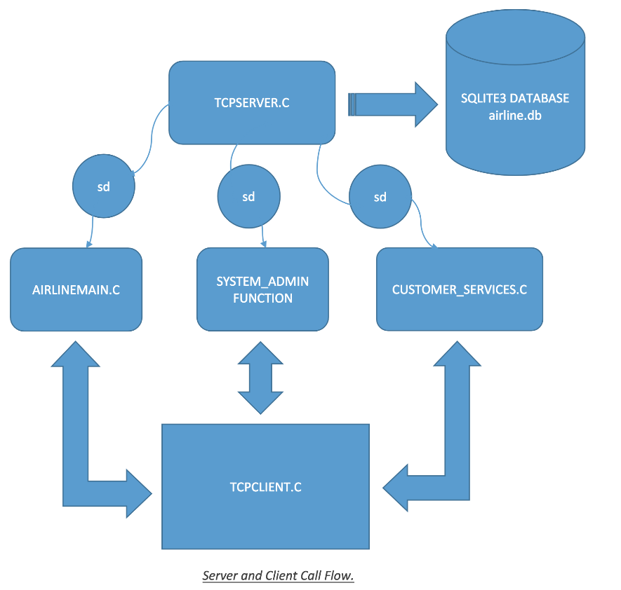

# Airline_Reservation_System_Project
## System Requirements:
> 1. Unix/Linux/MacOS X Operating systems 
> 2. GNU Compiler
## Server
### Code Compilation:
> $ ``` shell
    make
    ```
### Arguments Passed on Launch:
>$``` shell
    ./output 5501
    ```

## Client
### Code Compilation:
>$ ``` shell
    make
    ```
### Arguments Passed on Launch:
>$``` shell
    ./output 127.0.0.1 5501
    ```


